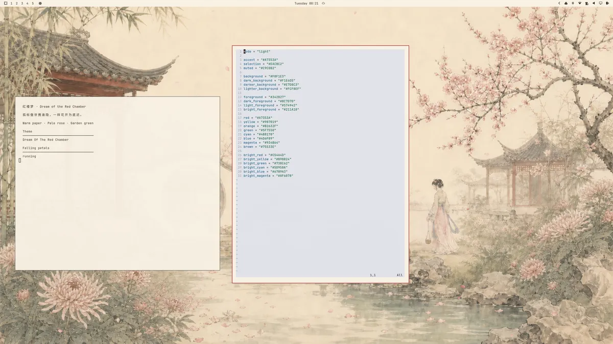

# Red Chamber Petals



*真实桌面截图：红楼梦主题与落花插件组合效果。 / Real desktop preview: the companion theme and falling-petal plugin together.*

A restrained falling-petal layer for Omarchy. It renders three bundled SVG
petals on Wayland's bottom layer and becomes active only when the current theme
opts in with a `red-chamber-petals.toml` marker.

The companion theme is
[`omarchy-dream-of-the-red-chamber-theme`](https://github.com/beijingrong/omarchy-dream-of-the-red-chamber-theme).

## Requirements

- Omarchy 4 with the Quattro shell plugin system
- Quickshell 0.3.1 or later, as supplied by Omarchy
- No additional packages, services, privileges, or background processes

## Install

```bash
omarchy plugin add https://github.com/beijingrong/omarchy-dream-of-the-red-chamber-petals.git --enable
omarchy theme install https://github.com/beijingrong/omarchy-dream-of-the-red-chamber-theme.git
```

The plugin remains loaded but idle on themes without the marker. It does not
install hooks or modify another theme.

## Remove

Switch away from the companion theme before removing it:

```bash
omarchy theme set tokyo-night
omarchy theme remove dream-of-the-red-chamber
omarchy plugin remove io.github.beijingrong.red-chamber-petals
```

Removal leaves no hook, service, package, or plugin-owned configuration file.
Omarchy removes the plugin's own entry from `~/.config/omarchy/shell.json`.

## Controls

```bash
omarchy-shell red-chamber-petals pause
omarchy-shell red-chamber-petals resume
omarchy-shell red-chamber-petals toggle
omarchy-shell red-chamber-petals status
```

`status` returns `running`, `paused`, or `inactive-theme`.

## Optional settings

Settings can be added to this plugin's entry in
`~/.config/omarchy/shell.json`:

```json
{
  "id": "io.github.beijingrong.red-chamber-petals",
  "fps": 20,
  "petals": 27,
  "density": 0.78,
  "speed": 1.0,
  "wind": 1.0
}
```

`fps` changes rendering cadence without changing physical fall speed. Petal
count, density, speed, and wind are clamped to conservative ranges, and each
screen is capped at 80 petals.

## Theme opt-in contract

A theme enables the effect by shipping this file at its repository root:

```toml
# red-chamber-petals.toml
enabled = true
```

The marker is data only. Omarchy safely stages it with the active theme, and
the plugin watches the staged file without executing theme code.

## Security and privacy

- No network access, shell commands, subprocesses, writable file access, or
  external downloads.
- Only the three local, static SVG assets in this repository are loaded.
- The layer has an empty input region, so keyboard and pointer input pass
  through.
- The plugin runs inside the existing `omarchy-shell` process and does not
  launch a second Quickshell instance.

Third-party Omarchy plugins run unsandboxed. Review the source before enabling
this or any other shell plugin.

## Validate

```bash
omarchy plugin validate .
/usr/lib/qt6/bin/qmllint -I "$OMARCHY_PATH/shell" \
  RedChamberPetals.qml ScreenRemapGuard.qml
```

## License

Plugin code and bundled petal SVGs: MIT. See [LICENSE](LICENSE).

The desktop preview (`preview.webp`) includes artwork from the companion theme, credited to beijingrong and shared under [CC BY 4.0](https://creativecommons.org/licenses/by/4.0/). See the [theme artwork provenance](https://github.com/beijingrong/omarchy-dream-of-the-red-chamber-theme#artwork-provenance).
